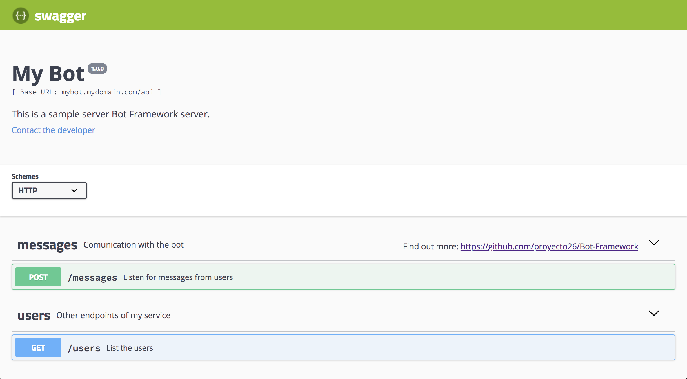
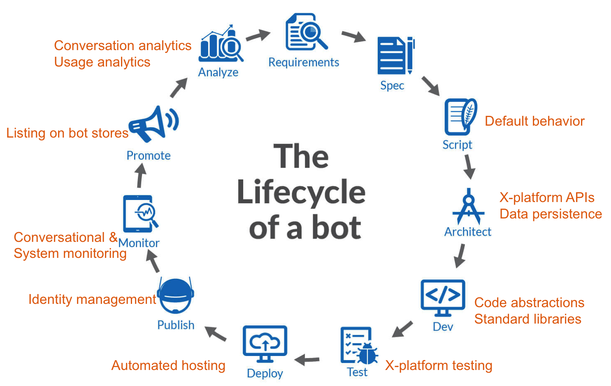
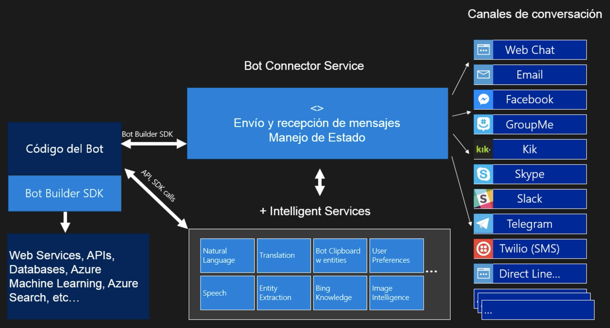
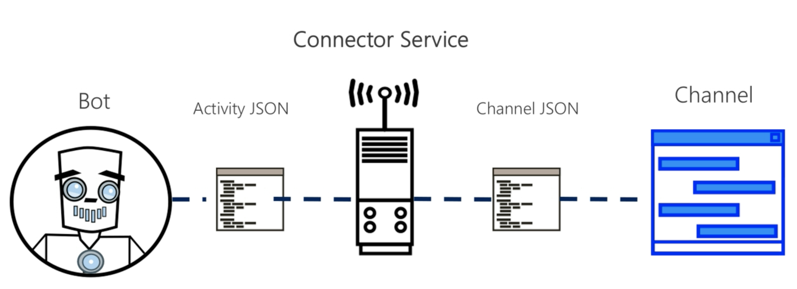

# Bots

## Templates

- [NodeJS(Express) + Swagger + Localization](src/nodejs) 

## Demo
Do you want to see this template in action? Download the code and the following tools:
- [Bot Framework Emulator](https://github.com/Microsoft/BotFramework-Emulator)
- [ngrok](https://ngrok.com/download) (Required to connect to a bot hosted remotely)

More examples with **NodeJS**:
- [BotBuilder](https://github.com/Microsoft/BotBuilder/tree/master/Node/examples)
- [BotBuilder-Samples](https://github.com/Microsoft/BotBuilder-Samples/tree/master/Node)

## History
- 1960: ELIZA
- 1970: PARRY
- 1980: Graphic interface
- 1990: Search engines
- 2000: Social/App stores
- 2010: Bots and agents, human Interaction/Experience

## Type of Chatbots
- **Utilities:** It fulfills a function for the users and is measured according to the effectiveness of the answers.
- **Social:** Success is measured according to the duration and level of user satisfaction, it is also possible to assess the level of satisfaction through APIs to recognize the level of emotion of users.
- **Assistants (Cortana, Siri, etc):** Acts as a facilitator, usually comes integrated with the Operating System. Main features:
  * Utilities and social capacities
  * Continuous relationship with the user
  * Manage system functions

## Communication flow
List the functions offered by the bot and describe a step by step for its execution:
- Task
- Objective
- Motivation of the user
- Steps
- Forecasts

## Experience components
- Learning and memory
- Perception and sense
- Personality (Intelligence)
- Logic and reason
- Accessibility
- Meaning and tone of text
- Cards
- Images
- Emojis
- Response time
- Conversational branch

## Design
- Inclusive design (Design for all types of public)
- UX (Avatar)
- Character with personality
- Define the devices and channels to support (Cortana, Email, Facebook, etc)
- Form flow (conversation follow-up, validate the data)
- Prevent redirections

## Lifecycle



# Bot Framework
Open Source Framework to create and connect bots (Cross channel, AI and Up-to-Date resources).


## Bot Connector Service 
Integrate the bot with different channels as Slack, Skype, Messenger, SMS, etc.


The **Bot Connector** can connect with the intelligence services and implement other functionalities such as:
- Ability to store the state of the conversation.
- Translate services.
- Telemetry. Information about the service is collected, such as the number of requests, messages that have failed, etc.

## Bot Developer SDKs 
SKDs for .NET, NodeJS or using REST APIs.
Integrate external services and Manage the conversation using LUIS system - Language Understanding Intelligent Service.


# Microsoft Cognitive Services
Set of APIs to create smart applications.

## Vision
Image-processing algorithms to smartly identify, caption and moderate your pictures.
- Computer Vision (Images)
- Emotion
- Content Moderator
- Face
- Video

## Speech
Convert spoken audio into text, use voice for verification, or add speaker recognition to your app.
- Custom Speech Service (CRIS)
- Speaker Recognition
- Speech
- Translator

## Language
Allow your apps to process natural language with pre-built scripts, evaluate sentiment and learn how to recognize what users want.
- Bing Spell Check
- Language Understanding
- Linguistic Analysis
- Text Analytics
- Web Language Model

## Knowledge
Map complex information and data in order to solve tasks such as intelligent recommendations and semantic search.
- Academic Knowledge
- Entity Linking
- Knowledge Exploration
- Recommendations
- QnA Maker

## Search
Add Bing Search APIs to your apps and harness the ability to comb billions of webpages, images, videos, and news with a single API call.
- Bing Autosuggest
- Bing Image Search
- Bing News Search
- Bing Video Search
- Bing Web Search

## Installation
- NodeJS via npm: `botbuilder`
- .NET via Nuget package: `Microsoft.Bot.Builder`

# [QnA Maker](https://qnamaker.ai/)
A free and easy-to-use REST API based on artificial intelligence to respond to users' questions in a natural way through an optimized learning logic (Machine Learning). It is a question and answer service with a graphical interface that allows it to be easy to administer.


<details>
 <summary>Example</summary>

```csharp
[Serializable]
public class QnADialog : QnAMakerDialog {

  public QnADialog() : 
  base(new QnAMakerService(new QnAMakerAttribute("subscriptionKey", "knowledgeId", "answer not found", 0.5)))
  {
  }

  protected override async Task RespondFromQnAMakerResultAsync(IDialogContext, IMessageActivity message, QnAMakerResult result)
  {
    Activity response = ((Activity)context.Activity).CreateReply();

    var firstAnswer = result.Answers.FirstOrDefault()?.Answer;
    var data = firstAnswer.Split("---");

    if(data.Length == 1) {
      return await context.PostAsync(firstAnswer);
    }

    //Example to get data with a separator
    var title = data[0];
    var description = data[1];
    var url = data[2];
    var image = data[3];

    CustomCard card = new CustomCard 
    { 
      Title = title, SubTitle = description
    };

    card.Buttons = new List<CardAction>
    {
      new CardAction(ActionTypes.OpenUrl, "text", value: url)
    };

    card.Images = new List<CardImage>{
      new CardImage(url = image)
    };

    response.Attachments.Add(card.ToAttachment());

    return await context.PostAsync(response);
  }
}
```
</details>

## Installation
- NodeJS via npm: `botbuilder-cognitiveservices`
- .NET via Nuget package: `Microsoft.Bot.Builder.CognitiveServices`

## QnA Maker Dialog
Personalization in the response to the user according to the reliability control.

```csharp
[Serializable]
[QnAMaker("subscriptionKey", "knowledgeId", "standard phrase when it doesn't satisfy the minimum response reliability index", 0.5, 1)]
public class QnADialogWithActiveLearning : QnAMakerDialog 
{
}
```

## Collaborators 🥇
[](https://github.com/jdnichollsc) |
:---: |
[Juan Nicholls](mailto:jdnichollsc@hotmail.com) |

## Credits 👍
- **[TI Capacitación](https://ticapacitacion.com)**

## Supporting 🍻
I believe in Unicorns 🦄
Support [me](http://www.paypal.me/jdnichollsc/2), if you do too.

## Happy coding 💯
Made with ❤️


